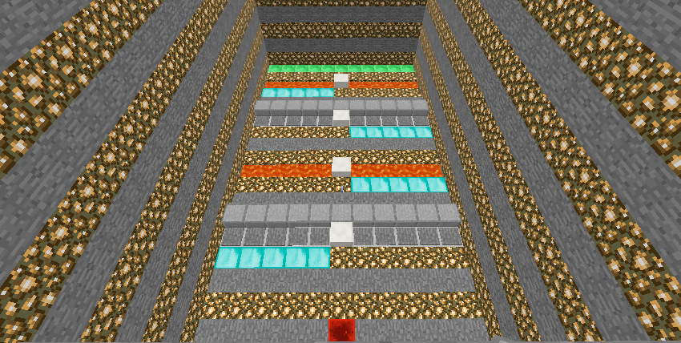
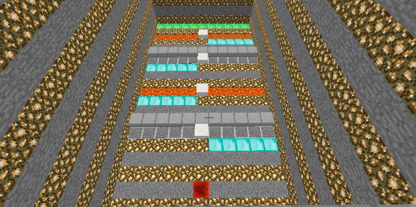
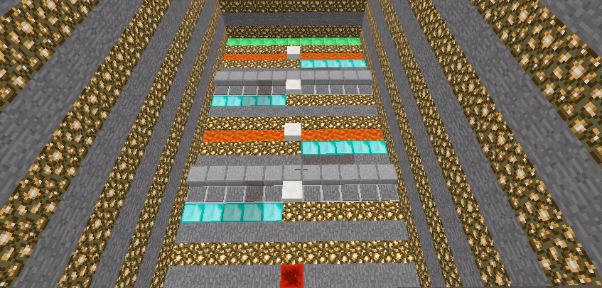
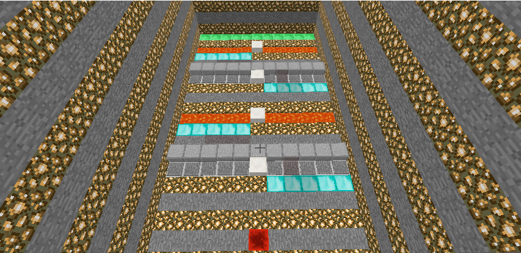

## Video
 
## Project Summary
Our project will involve training an agent to navigate a environment filled with dangerous traps and obstacles to overcome. The agent's goal is safely walk through an environment fills with hot lava and numerous traps. For this project, we designed 4 different maps.

### Figure 1 - Map 1

### Figure 2 - Map 2

### Figure 3 - Map 3

### Figure 3 - Map 3

The agent only allow 3 actions, go forward, strafe left and strafe right. Using Malmo along with some Reinforcement Learning algorithms the agent will take in a state which includes the agent's current position in (x, y, z) format and the agent's yaw (the direction the agent is facing). The agent's reward for any one mission will be depend on how close the agent was to the goal location by the end of mission's running time. The action space will be continuous and include the following actions: moving forward, turning, and use pressure plate to travel through hot lava.

The problem is not particularly trivial to solve using brute force algorithms or some form of scripted method because the maps are complex. And additionally, the maps are rotated randomly, making it impossible to use a discrete algorithm to solve such a stochastic problem. AI/ML algorithms can help solve these problems faster since it can learn and improve from experience over time. This allows the agent to take more practical actions in less predictable dynamic environments.

## Approaches
### Reward
In the status report, we allowed the agent to move forward, backward, strafe left and strafe right. We gave the agent reward for each step that took him closer to the goal and one big reward when he reached the goal. This was a bad idea because the agent might get infinite reward by walking in circle or kept walking back anf forth in one place. Therefore in the final report, we limited his movements to forward, strafe left and strafe right. Also for the reward, we did not give him one big reward for completion.

### Reward Changes
Punishment for falling into lava:
- Purpose: to train the agent to avoid stepping on lava
- Failure reason: not work very efficiently

Rewards for reaching the destination:
- Original:reaching the destination will receive _ points
- Now: falling into the lava: 0; 1 step closer to reaching the destination: 1
- Purpose: 
- Failure reason:

## Evaluation

## References
