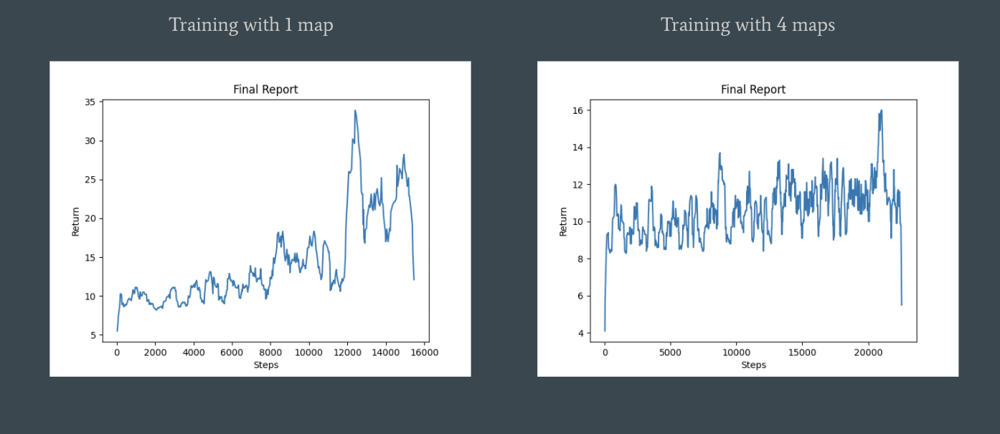

## Video

<iframe width="560" height="315" src="https://www.youtube.com/embed/m_dbPTm5x70" frameborder="0" allow="accelerometer; autoplay; clipboard-write; encrypted-media; gyroscope; picture-in-picture" allowfullscreen></iframe>
 
## Project Summary
Our project will involve training an agent to navigate a environment filled with dangerous traps and obstacles to overcome. The agent's goal is safely walk through an environment filled with hot lava and numerous traps. The map design includes different paths the agent can take with different consequences and results. Pressure plates are planted in the environment to allow our agent to make it across the lava safetly. The catch is, some of the pressure plates create a path across the dangerous lava and some do nothing to help. The helpful pressure plates will be labeled with strips of diamond blocks. We wanted to challenge our agent by changing up which pressure plates would help him during his missions. These changes can be visually seen by the changing locations of the diamond strips. We created 4 different map variations that can be seen below.

### Figure 1 - Map 1

### Figure 2 - Map 2

### Figure 3 - Map 3

### Figure 4 - Map 4

The agent's action space only contains 3 actions, move forward, strafe left and strafe right. Using Malmo along with the PPO Reinforcement Learning algorithm the agent will take in a state which includes information about the agent's surrounding environment. The agent's observation allows the agent to know where the lava blocks are and where the diamond blocks. Giving the agent information related to the diamond blocks was our way of helping the agent learn which pressure plates would lead to more successful missions given the fact that the map changes across the different missions. The agent's reward for any one mission will be depend on how close the agent was to the goal location by the end of mission's running time. For this stage in our project we decided to change how the reward was being administered to our agent. In our previous report, we gave the agent one big reward at the end indicating how close he was to the goal during that particular mission. This time around we're giving him multiple small rewards during the mission in the hopes of improving the quality of our agent's learning.

The problem is not particularly trivial to solve using brute force algorithms or some form of scripted method because the maps are complex and the agent has limited information related to the dangerous environemnt around him. And additionally, the maps are rotated randomly, making it impossible to use a discrete algorithm to solve such a stochastic problem. ML/RL algorithms can help solve these problems faster since it can learn and improve from experience over time. This allows the agent to take more practical actions in less predictable dynamic environments.

## Approaches
### Reward
In the status report, we allowed the agent to move forward, backward, turn left and turn right. We gave the agent reward for each step that took him closer to the goal rather than one big reward when he reached the goal. 

### Reward Changes
Punishment for falling into lava:
- Purpose: to train the agent to avoid stepping on lava
- Failure reason: We realized that our training design only allows the mission to end if the agent falls in lava or reaches the goal therefore, giving our agent a negative reward for falling in the lava is useless.

### Observation Space Changes
Change from coordinates to grid observation:
- Purpose: to prevent our agent from memorizing a path as opposed to actually learning how the environments worked and the best way to traverse them. This change was also necessary because of our design decision regarding the randomally chosen map variation between differnet missions.
- Failure reason: We realized our previous observation design would lead to memorization rather than actual learning.

### Action Changes
Change back to discrete from continous and the removal of walking backward
- Purpose: we wanted to streamline what the agent should and shouldnt be allowed to do to prevent an excess amount of useless actions. We also changed back to discrete for this final iteration to simplify the learning process in order to witness better results.
- Failure reason: In our status report, we used a continous action space and gave the agent a lot of freedom with his movement around the environemnt. This led to pretty much zero learning due to the fact that the action space was so large and the agent had the freedom to basically do nothing with his mission time by walking around in circles and jumping in place. 

## Evaluation
### Quantitative Evaluation
The agent will receive one point each time he is one step closer to the goal, and if he falls into the lava, he will die immediately and consequently fail the misson. The experiment will be conducted by letting the agent finds his way through 4 different maps, which are chosen randomly each mission. 
- For the first experiment with only one map, we can see that the agent learned more about what he should be doing and learned in a faster fashion. 
- For the second experiment with 4 maps chosen at randomly, we can see a slight increase in reaward overtime but the agent learned much slower and less effectively overall.

Result Graph

### Qualitative Evaluation
Overall, with enough training time the agent in both experiments were able to reach points closer to the goal compared to when they started their training. For the single map experiment specifically, the agent had some streaks of being able to make it to the goal decently consistently. However, even at these later stages of training, the agent was still prone to making mistakes at all stages of the mission. This was the best result we were able to achieve with our current environment setup. Our dream for this final project was to try to train our agent on multiple dynamic environments. This is why we created the variations of the original dynamic environment to rotate through while training our agent. Unfortunately the agent had a much harder time training in these circumstances for more than one reason. The obvious reason is that its harder for the agent to learn if the map changes between missions. The second reason is a more technical reason. We noticed that Malmo takes a decent amount of time loading up a map that is different from the map used in the previous mission. We believe this is because Malmo can only keep a single map in its "memory" at a time which makes constantly switching maps a decently large time cost.

## References
- Project Malmo - https://microsoft.github.io/malmo/0.14.0/Documentation/classmalmo_1_1_agent_host.html#ac1421c4ed9ababff1300ea58a37859bc
- UCI CS 175 HW2 Template
- Malmo Platform Tutorial - https://microsoft.github.io/malmo/0.17.0/Python_Examples/Tutorial.pdf
- XML Schema Documentation - https://microsoft.github.io/malmo/0.30.0/Schemas/MissionHandlers.html#SchemaProperties
- Index page Minecraft Image - https://images9.gry-online.pl/galeria/galeria_duze3/396263203.jpg
